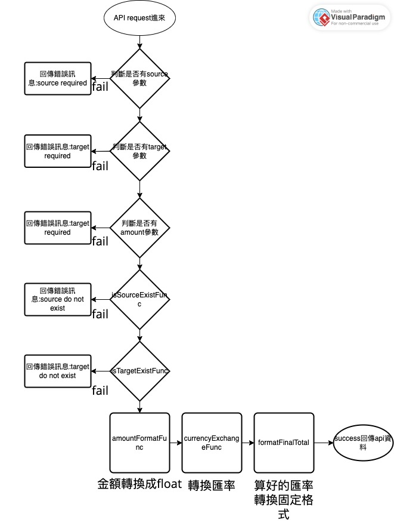

## Currency Exchange APIs

執行 unittest：`npm test`

啟動程式：`npm run dev`

Api Design
| Methods | Urls | Actions | Params
|---|---|---|---|
| GET | /api/exchange | 幣別匯率轉換 | source:原本幣別, target：兌換幣別, amount：要兌換的金額

使用範例：

> ?source=USD&target=JPY&amount=$1,525

輸出範例：

```json
{
    "msg": "success",
    "amount": "$170,496.53"
}
```

錯誤訊息範例：

```json
{
    "msg": "error",
    "data": "source currency does not exist."
}
```

Api 流程圖

